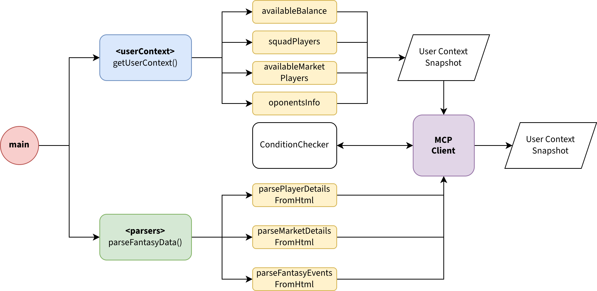

# Fantasy MCP


A **TypeScript (ESM) fantasy-football data engine built with Clean Architecture**, focused on:

- scraping and parsing fantasy football data
- collecting user context via CLI
- orchestrating end-to-end use cases
- enabling future UI and LLM-driven workflows

The project is **Bun-first, strictly typed, and heavily documented**.

## Tech stack

- **Runtime**: Bun
- **Language**: TypeScript (ESM, moduleResolution: nodenext)
- **Architecture**: Ports & Adapters (Clean Architecture)
- **Scraping**: Axios + Cheerio
- **Validation / Schemas**: Zod → JSON Schema
- **LLM integration**: Provider-agnostic ports
- **Docs**: TypeDoc
- **Linting**: ESLint v9 + JSDoc enforcement

## Installation

### Prerequisites

- NodeJS
- Bun ≥ 1.0.0

### Install dependencies

```sh
bun install
```

## CLI Usage

### 1️⃣ Fetch a player snapshot (end-to-end use case)

Fetches, parses, and aggregates all available data for a player:
- fantasy match events
- player details
- market details

```sh
bun run scrap
```

With a specific player slug:

```sh
bun run scrap pedri
```

What happens internally:

1.	HTML pages are fetched via an HTTP gateway
2.	Pages are parsed using dedicated extractors
3.	Results are aggregated by a single application use case
4.	Structured JSON is printed to stdout

### 2️⃣ Collect user context via CLI

Prompts the user for fantasy-related inputs:
- available balance
- squad players
- market players
- opponents info

bun run setup

Outputs a single user context snapshot JSON object, ready to be consumed by future lineup builders or LLM workflows.

## Architecture overview

The project follows Clean Architecture strictly.

```sh
src/
├── domain/          # Pure domain contracts and models
│   ├── config/
│   └── fantasy/
│
├── application/     # Use cases & orchestration
│   ├── fantasy/
│   └── llm/
│
├── infrastructure/  # Adapters (HTTP, scraping, CLI, LLM providers)
│   ├── fantasy/
│   └── http/
│
└── interfaces/      # Entry points (CLI)
```



### Key principles

- Domain has no dependencies
- Application orchestrates, never scrapes
- Infrastructure adapts external systems
- Interfaces wire everything together

## LLM integration

The project includes a provider-agnostic LLM layer:

- `LlmModelPort` defines the contract
- Supports:
  - free-form completions
  - schema-constrained (structured) completions
  - Zod schemas are automatically converted to JSON Schema

This allows:

- OpenAI / local models / mocks
- deterministic, typed LLM outputs
- easy future MCP / agent integration

## Documentation (TypeDoc)

### Generate API docs

```sh
bun run docs
```

Docs are generated into `docs/api/`

### Viewing docs in a browser

TypeDoc does not run a web server.

You have two options:

#### Option A — HTML docs (recommended for development)

1.	Disable typedoc-plugin-markdown
2.	Run:

```sh
bun run docs
open docs/api/index.html
```

#### Option B — Markdown docs (recommended for publishing)

- Keep typedoc-plugin-markdown
- Serve with a static server:

```sh
bunx serve docs/api
```

Or integrate with VitePress / Docusaurus / GitHub Pages.

### Documentation enforcement (ESLint)

The project enforces documentation coverage using ESLint:

- All exported APIs must have doc comments
- Application use cases are strictly documented
- Internal helpers may remain undocumented

### Run linting:

```sh
bun run lint
bun run lint:docs
```

Missing docs will fail CI.

## Coding conventions

- ESM only ("type": "module")
- Explicit imports with .js extensions
- Strict TypeScript (strict: true)
- No implicit domain logic in infrastructure
- Thin adapters, rich use cases
- Docstrings explain intent, not just behavior

## Roadmap

- Lineup builder use case
- Web UI adapter (swap CLI)
- Cached / offline gateways
- LLM-assisted lineup optimization
- MCP server exposure